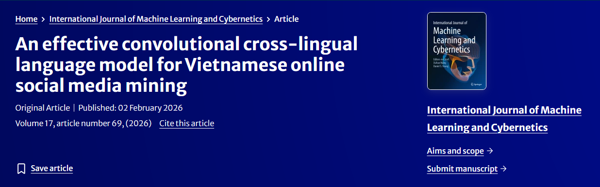
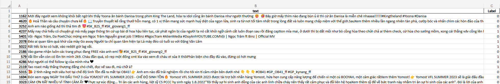
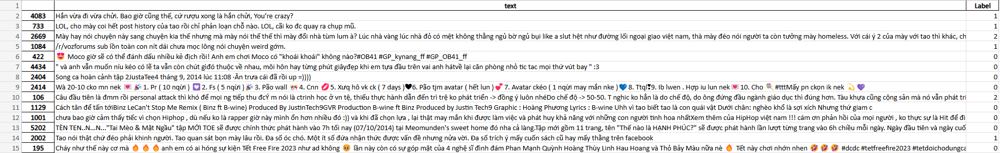
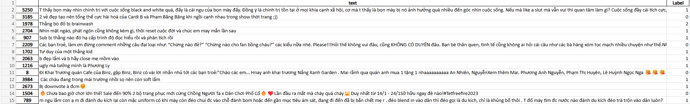

<div align="center">



# 🇻🇳 ViCM: Vietnamese Code-Mixed Dataset

**The first publicly available dataset for code-mixed Vietnamese hate speech detection**

[](https://link.springer.com/article/10.1007/s13042-025-02904-6)
[](https://creativecommons.org/licenses/by/4.0/)
[](https://github.com/tiennho2608/ViCM)
[](https://link.springer.com/journal/13042)

</div>

---

## 📌 Overview

**ViCM** (*Vietnamese Code-Mixed*) is the **first human-annotated dataset** for code-mixed hate speech detection in Vietnamese social media. As Vietnamese users increasingly blend Vietnamese with English and other languages in online comments, existing NLP resources have failed to capture this linguistic reality — until now.

> ⚠️ **Disclaimer:** This dataset contains real social media comments that may be considered offensive, hateful, or abusive. It is intended strictly for research purposes.

---

## 🔬 Research Context

This dataset was created as part of the paper:

> **"An Effective Convolutional Cross-Lingual Language Model for Vietnamese Online Social Media Mining"**
> Tien Minh Nguyen, Tue Minh Nguyen, Tin Van Huynh, Kiet Van Nguyen
> *International Journal of Machine Learning and Cybernetics*, Volume 17, Article 69, 2026
> 🔗 https://doi.org/10.1007/s13042-025-02904-6

Our work proposes a **cross-lingual language model with 1D-CNN layers** and a **custom loss function** to tackle class imbalance — achieving state-of-the-art performance on **VSMEC**, **VSFC**, and **ViSpam** benchmarks.

---

## 💡 Why ViCM?

| Challenge | Our Solution |
|---|---|
| No existing code-mixed Vietnamese dataset | ✅ First dataset of its kind (5,415 samples) |
| Class imbalance in hate speech data | ✅ Custom focal loss function |
| Poor feature extraction from short comments | ✅ 1D-CNN layers for local feature capture |
| Cross-lingual complexity | ✅ XLM-R backbone with multilingual pretraining |

---

## 📂 Dataset Files

### 📁 Repository Structure

```
ViCM/
├── data/
│   ├── train.csv        ← Training split (3,787 samples)
│   ├── dev.csv          ← Validation split (542 samples)
│   └── test.csv         ← Test split (1,086 samples)
├── images/              
└── README.md
```

---

### 🗂️ `train.csv` — Training Split



The main training data used to fit classification models. Contains **3,787** labeled code-mixed Vietnamese social media comments — the largest portion of the dataset.

---

### 🗂️ `dev.csv` — Validation Split



Used during training for hyperparameter tuning and early stopping. Contains **542** samples to help prevent overfitting on the training data.

---

### 🗂️ `test.csv` — Test Split



The held-out evaluation set with **1,086** samples. Used exclusively for final benchmarking — never seen by the model during training.

---

## 📊 Dataset Statistics

| Split | Total | Label 0 (Clean) | Label 1 (Hate) | Label 2 (Offensive) |
|-------|-------|-----------------|----------------|----------------------|
| Train | 3,787 | 2,216 | 1,356 | 215 |
| Dev   | 542   | 331   | 180   | 31  |
| Test  | 1,086 | 625   | 389   | 72  |
| **Total** | **5,415** | **3,172** | **1,925** | **318** |

---

## 🧾 Data Format

Each `.csv` file contains the following columns:

| Column  | Type     | Description |
|---------|----------|-------------|
| `id`    | `int`    | Unique comment identifier |
| `text`  | `string` | Raw social media comment (code-mixed Vietnamese) |
| `Label` | `int`    | `0` = Clean, `1` = Hate Speech, `2` = Offensive |

**Example:**

| id | text | Label |
|----|------|-------|
| 1162 | "Mới đây người xem không khỏi bất ngờ..." | 0 |
| 4083 | "Hắn vừa đi vừa chửi. Bao giờ cũng thế..." | 1 |
| 1978 | "Thằng bò đỏ bị brainwash" | 2 |

---

## 🚀 Quick Start

```python
import pandas as pd

# Load splits
train_df = pd.read_csv("data/train.csv")
dev_df   = pd.read_csv("data/dev.csv")
test_df  = pd.read_csv("data/test.csv")

print(f"Train: {len(train_df)} samples")  # 3787
print(f"Dev:   {len(dev_df)} samples")    # 542
print(f"Test:  {len(test_df)} samples")   # 1086

# Preview
print(train_df.head())
```

---

## 📝 Citation

If you use the **ViCM** dataset in your research, please cite our paper:

```bibtex
@article{nguyen2026effective,
  title={An effective convolutional cross-lingual language model for Vietnamese online social media mining},
  author={Nguyen, Tien Minh and Nguyen, Tue Minh and Huynh, Tin Van and Nguyen, Kiet Van},
  journal={International Journal of Machine Learning and Cybernetics},
  volume={17},
  number={2},
  pages={69},
  year={2026},
  publisher={Springer}
}
```

---

## 📜 License

This dataset is released under the
[Creative Commons Attribution 4.0 International (CC BY 4.0)](https://creativecommons.org/licenses/by/4.0/) license.

You are free to share and adapt the material for any purpose, provided appropriate credit is given.

---

## 👥 Authors

| Name | Affiliation |
|------|-------------|
| **Tien Minh Nguyen** | University of Information Technology, VNUHCM |
| **Tue Minh Nguyen**  | University of Information Technology, VNUHCM |
| **Tin Van Huynh**    | University of Information Technology, VNUHCM |
| **Kiet Van Nguyen**  | University of Information Technology, VNUHCM |

📧 Contact: tiennm26082002@gmail.com

---

## 🙏 Acknowledgements

This research was supported by **The VNUHCM-University of Information Technology's Scientific Research Support Fund**.

---

<div align="center">
  <sub>Made with ❤️ for the Vietnamese NLP community</sub>
</div>